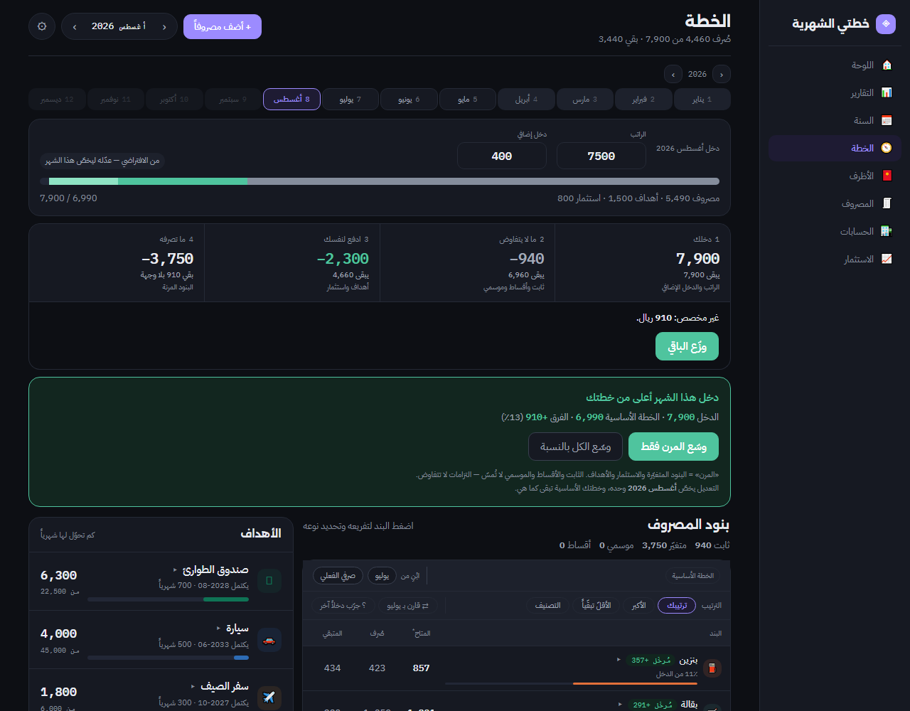
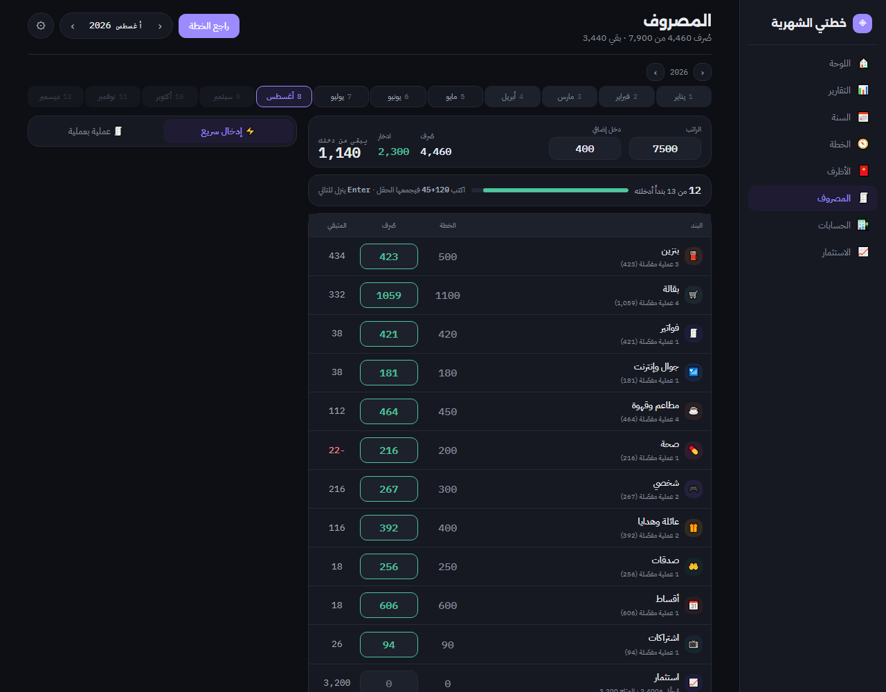
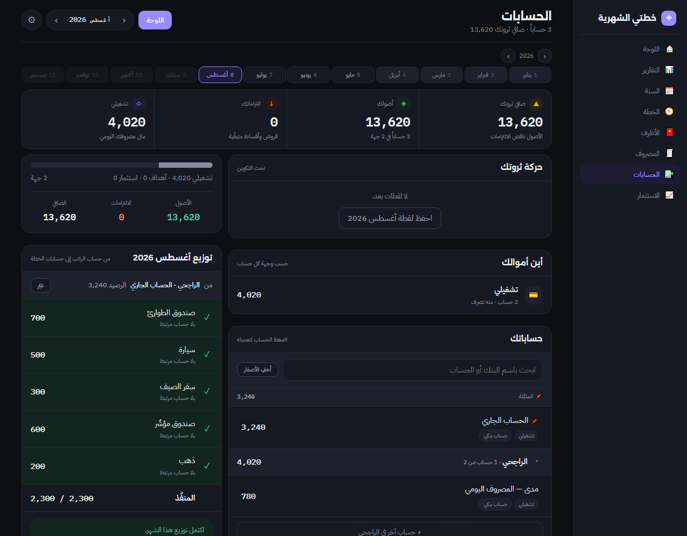
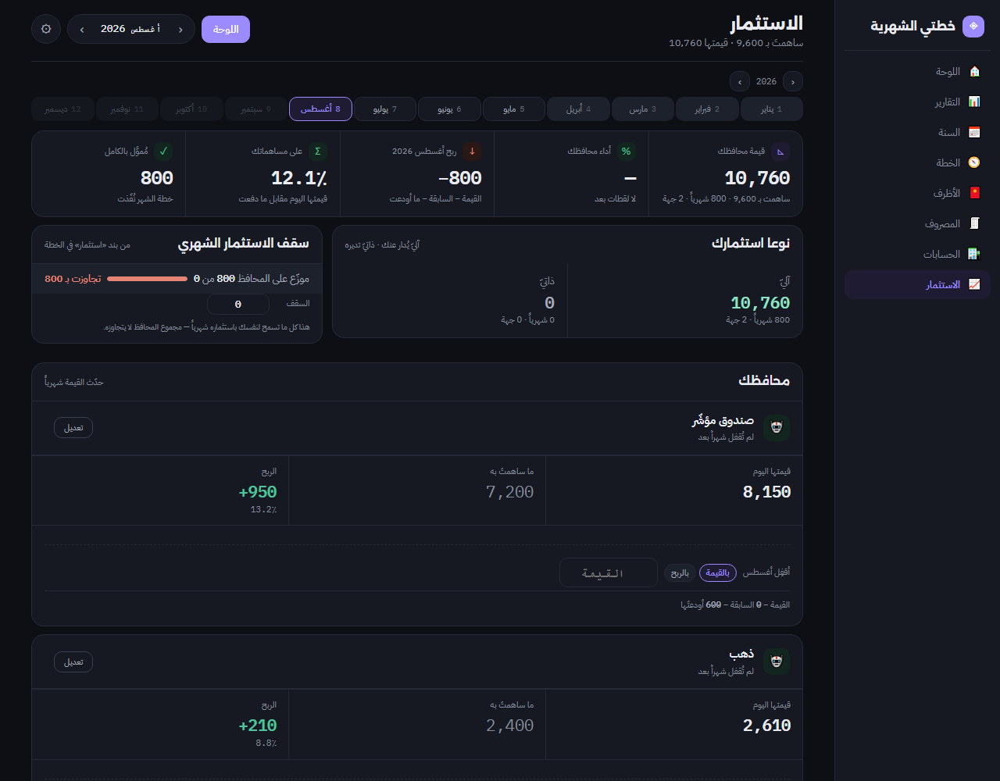
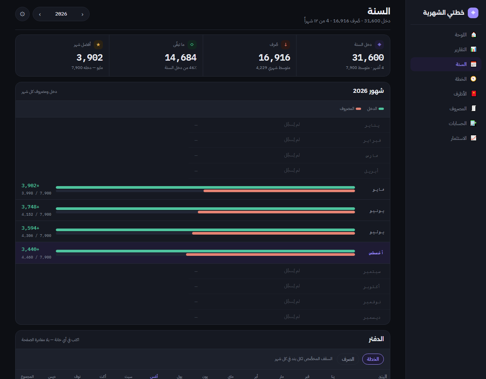
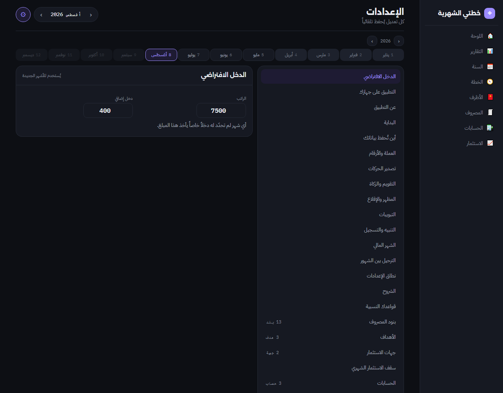

# مصروف — خطتي الشهرية

تطبيق ميزانية شهرية بالعربية. **افتحه من هنا:**

### 🔗 [relifeg1.github.io/masrouf](https://relifeg1.github.io/masrouf/)

لا حساب مطلوب، ولا خادم يحمل مالك. بياناتك في جهازك ما لم تختر غير ذلك.

> **إصدار تجريبي.** يعمل ويُستعمل يومياً، لكنه لم يُجرَّب على أجهزة كثيرة بعد.
> خذ نسخة احتياطية من حين لآخر (الإعدادات ← النسخة الاحتياطية).

---

## الشاشات

### اللوحة — أين أنت هذا الشهر

### الخطة — أربع مراحل، كلٌّ تُغلق برقم «يبقى بعدها»

### الإدخال السريع — الدخل والخطة والصرف في جدولٍ واحد

### التقارير — أين انتهى راتبك فعلاً

### الحسابات — أرصدتك الحقيقية

### الاستثمار — عائدك محسوباً على القاعدة الصحيحة

### السنة — اثنا عشر شهراً في نظرة

### الإعدادات — شاملة للتطبيق كلّه، لا لكل شهر على حدة

---

## كيف تُثبّته

ثلاث طرق، وأخفّها أوّلاً.

### ١ · من المتصفّح — بلا تنزيل

افتح [الرابط](https://relifeg1.github.io/masrouf/)، ثم:

| | |
|---|---|
| **أندرويد وسطح المكتب** | قائمة المتصفّح ← «تثبيت التطبيق» · أو زرّ «ثبّته» في الإعدادات |
| **آيفون** | شارك ← «إضافة إلى الشاشة الرئيسية» |
| **ماك · سفاري ١٧+** | شارك ← «إضافة إلى Dock» |

بعدها: أيقونة على شاشتك · يفتح بلا شريط متصفّح · **ويعمل بلا إنترنت**.
ولا تحذيرات نظام، ولا شيء يُنزَّل.

### ٢ · تطبيق سطح المكتب

بمحرّك كروميوم مضمَّن — نسخةٌ واحدة عند الجميع لا محرّك النظام.
من [صفحة الإصدارات](https://github.com/relifeg1/masrouf/releases/latest):

| النظام | الملفّ | الحجم |
|---|---|---|
| **ويندوز** | [`Masrouf-Setup.exe`](https://github.com/relifeg1/masrouf/releases/latest) | ١١١MB |
| **ماك · Apple Silicon** (M1 فأحدث) | `Masrouf-arm64.dmg` | ١٢٨MB |
| **ماك · Intel** | `Masrouf.dmg` | ١٣٢MB |

**التحديث يصلك ولا يُفرض عليك:** ينزل في الخلفية ثم يقف وينتظر ضغطتك —
«انسخ بياناتي ثم حدّث» · «حدّث بلا نسخة» · «لاحقاً». ولا يُثبَّت شيءٌ
خلسةً عند الإغلاق.

**والنسخة الاحتياطية حوارُ حفظٍ من النظام** — تختار المجلّد والاسم
(مصروف ← احفظ نسخة احتياطية · `Ctrl+S`).

**ونسخة الماك تُبنى على ماك** في GitHub Actions، لا تُركَّب على ويندوز.

> ⚠️ **بياناتك الحالية لن تنتقل وحدها.** تخزين تطبيق سطح المكتب منفصلٌ
> عن متصفّحك. فمن استعمل النسخة السابقة يجد الجديدة فارغة. المسار:
> افتح القديمة ← الإعدادات ← النسخة الاحتياطية ← **انسخها**، ثم في
> الجديدة: الإعدادات ← **استعادة**. أو سجّل دخولك بحسابك فتنزل من هناك.

> **تحذير النظام متوقَّع** — غير موقَّع رقمياً (التوقيع يُشترى سنوياً).
> ويندوز: «مزيد من المعلومات» ← «تشغيل على أي حال».
> ماك: انقر باليمين على التطبيق ← «فتح» في أوّل مرة فقط.

### ٣ · مشغّلٌ خفيف (٢٠KB)

لمن يريد أيقونةً على ويندوز بلا مئة ميغابايت: مثبِّتٌ صغير يفتح التطبيق
في نافذةٍ مستقلّة عبر المتصفّح المثبَّت عندك. في
[الإصدار 1.2.0](https://github.com/relifeg1/masrouf/releases/tag/v1.2.0).

---

## أين تُحفظ بياناتك — أنت تختار

يسألك التطبيق بعد أن يبني خطتك، وتغيّر جوابك متى شئت من الإعدادات:

| الخيار | ماذا يعني |
|---|---|
| **هذا الجهاز وحده** | لا تسجيل ولا إنترنت. ولو ضاع الجهاز أو مُسحت بيانات المتصفّح ضاعت معه — فخذ نسخة احتياطية. |
| **حسابك** | تدخل ببريدك أو بحساب Google، فتجدها في هاتفك وحاسوبك معاً. بلا كلمة مرور تُنشأ أو تُحفظ. |
| **قاعدةٌ تملكها** | لمن يريد بياناته في مشروع Supabase باسمه هو. |

**نسخةٌ في جهازك دائماً** مهما اخترت — ولذلك يعمل بلا إنترنت.

خيار «حسابك» يظهر في النسخ المهيّأة بمفاتيح مشروع. للتهيئة انظر [SETUP.md](SETUP.md)
و[schema.sql](schema.sql). ولا مفاتيح في هذا المستودع.

---

## التحديثات تصلك من نفسها

كلّ فتحةٍ للتطبيق تسأل الموقع عن نسخةٍ جديدة. وإن وُجدت ظهر لك شريط
«نسخة جديدة جاهزة» — **ولا تُفرض عليك وأنت تكتب**: تحدّث حين تشاء.

وقبل أيّ تحديثٍ يغيّر بنية البيانات تُحفظ **لقطة** لما عندك، وفي الإعدادات
زرّ «ارجع إليها» إن ساءك شيء.

**وفي تطبيق سطح المكتب** طبقتان: محتوى التطبيق يصلك من الموقع فوراً كما
سبق، وهيكل التطبيق نفسه يُنزَّل من صفحة الإصدارات ثم **يقف وينتظر
ضغطتك** — ولا يُثبَّت خلسةً عند الإغلاق.

---

## ما فيه

**الخطة** — مسار من أربع مراحل: دخلك ← ما لا يتفاوض ← ادفع لنفسك ← ما تصرفه.
كل مرحلة تُغلق برقم «يبقى بعدها». ومعها «ابْنِ خطتي» من متوسط صرفك الفعلي،
و«وزّع الباقي» بضغطة، و«جرّب دخلاً آخر» قبل أن تلتزم.

**الإدخال السريع** — جدول واحد فيه الدخل والخطة والصرف والادخار والاستثمار.
الحقل يحسب (`120+45` تصير `165`)، وEnter ينزل للتالي، وزرٌّ يملأ الفارغ بمثل الشهر الماضي.

**التقارير** — مسار الريال (أين انتهى دخلك) · دقّة خطتك (أي بند تتجاوزه دائماً) ·
ادخارك الحقيقي · والفرق غير المفسَّر بين خطتك ورصيدك.

**الأظرف** — كل بند حساب مستقل: يدخله مبلغ خطته، ويخرج منه ما تصرفه، والباقي يبقى فيه.

**الحسابات والاستثمار** — أرصدتك الحقيقية، وقيمة محافظك شهراً بشهر بعائدٍ محسوب
على القاعدة الصحيحة (القيمة ÷ (السابقة + ما أودعت)) لا على قسمةٍ ساذجة.

**وأشياء محلّية** — التقويم الهجري (من تقويم أم القرى في متصفّحك) · وزكاة المال
تقديراً · وبداية شهرٍ ماليّ تختارها بيوم قبض راتبك لا بأوّل الشهر.

---

## التصدير

**نسخة احتياطية** (JSON) للاستعادة · و**CSV** لحركاتك تفتحها في Excel. كلاهما من الإعدادات.

---

## ماذا لو انكسر شيء

الإعدادات ← النسخة الاحتياطية ← **انسخها** أولاً، ثم افتح
[issue](../../issues) واذكر: ما فعلتَ · ما توقّعت · وما حدث.
ولا ترفق نسختك الاحتياطية في issue علنيّ — فيها مالك.

---

## البناء

`index.html` ملفٌّ واحد يُبنى من نسخة التطوير: تُستبدل بياناتها بحالةٍ فارغة،
ويُفحص الناتج فيتوقّف البناء إن بقي أثرٌ شخصيّ، ويُحقن رقم النسخة في التطبيق
وعامل الخدمة معاً من مصدرٍ واحد.

**تطبيق سطح المكتب** في `desktop/`: إلكترون + electron-builder.
`npm ci && npx electron-builder --win` يبني نسخة ويندوز محلّياً.
ونسخة الماك تحتاج macOS، فيبنيها
[مسار Actions](.github/workflows/desktop.yml) عند كل وسم `v*` ويرفع
الملفّات إلى الإصدار — بناءً ثم رفعاً في وظيفتين منفصلتين، لأن النشر
المتوازي من وظيفتين يمسح إحداهما مرفقات الأخرى.

**والمشغّل الخفيف** في `tools/`: `python tools/build_exe.py` — بلا حزم
ولا تنزيل، باستعمال `csc` المرافق لـ.NET Framework في كل ويندوز.

## الترخيص

MIT — انظر [LICENSE](LICENSE).
